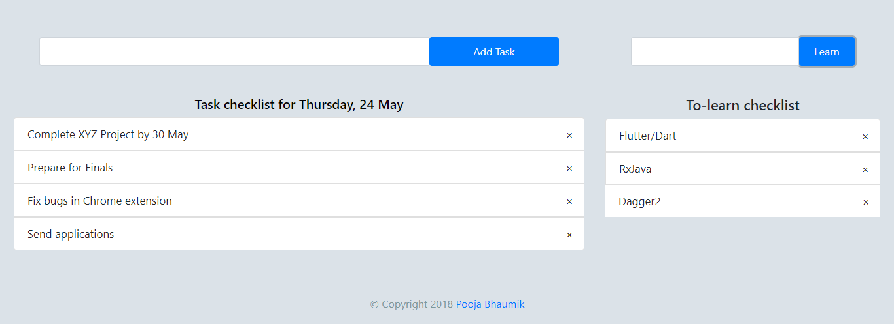

# Todos
Displays your to-do tasklist for the day along with to-learn checklist everytime you are opening a new tab in Google Chrome

## Installation
* Fork and clone this project to your local system
* Unzip the folder contents
* Open Google Chrome and go to Options menu on the right end (the three dots) and select More Tools > Extensions.
* Enable Developer Mode
* Load unpacked extension and select the root folder of the project

